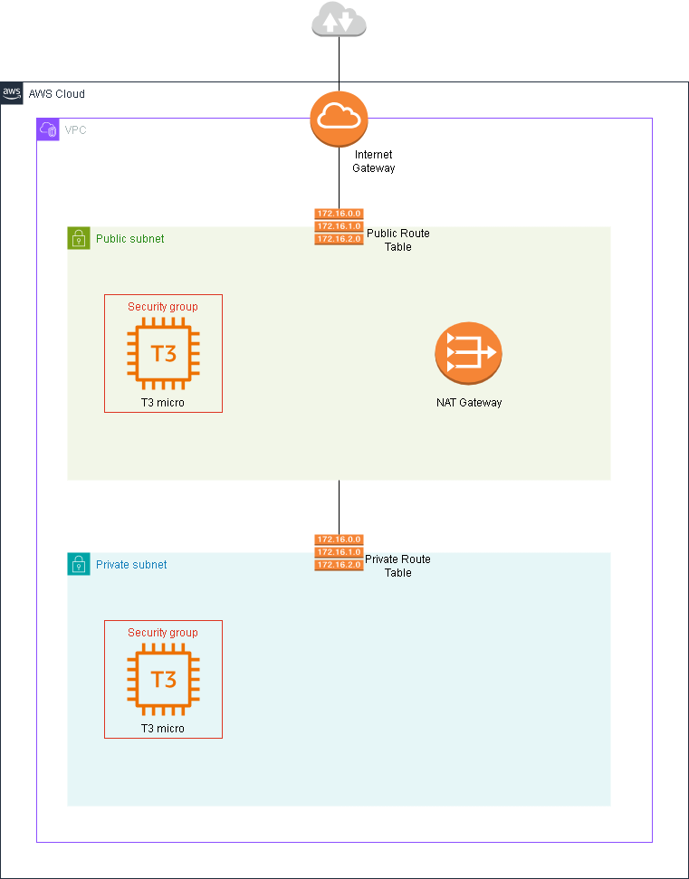

# AWS VPC Networking Lab with Terraform

This project provisions a small AWS network from scratch using Terraform. It demonstrates public and private subnet routing, controlled SSH access through a bastion host, and outbound internet access from a private EC2 instance through a NAT Gateway.



## Architecture

The infrastructure is deployed into a single Availability Zone and contains:

- One VPC using the `10.0.0.0/24` CIDR block
- One public subnet using `10.0.0.0/27`
- One private subnet using `10.0.0.32/27`
- An Internet Gateway and a public route table
- A NAT Gateway with an Elastic IP and a private route table
- A public `t3.micro` EC2 instance acting as a bastion host
- A private `t3.micro` EC2 instance without a public IP address
- Separate security groups and SSH key pairs for both EC2 instances

Traffic follows these paths:

```text
Local machine
    |
    | SSH
    v
Public EC2 instance (bastion host)
    |
    | SSH through a security group reference
    v
Private EC2 instance
    |
    | HTTPS
    v
NAT Gateway -> Internet Gateway -> Internet
```

# How to use? (instruction for Linux)

## Prerequisites

- An AWS account with permissions to create the resources used by this project
- Terraform `1.15.8` or newer
- AWS CLI `2.32.0` or newer
- OpenSSH `7.3` or newer
- An authenticated AWS CLI session

Do not use the AWS account root user. Use an IAM User instead.

Verify the installed tools and current AWS identity:

```bash
  terraform version
  aws --version
  ssh -V
  aws sts get-caller-identity
```

## Deployment

### 1. Enter the Terraform directory

```bash
  cd infra
```

### 2. Generate SSH key pairs

Generate one key pair for the bastion host and another for the private instance:

```bash
  ssh-keygen -t ed25519 -C "public_instance_key" -f ~/.ssh/public_instance_key
  ssh-keygen -t ed25519 -C "private_instance_key" -f ~/.ssh/private_instance_key
```

Copy only the public keys into the Terraform directory:

```bash
  cp ~/.ssh/public_instance_key.pub .
  cp ~/.ssh/private_instance_key.pub .
```

The private keys remain in `~/.ssh` and must never be committed to the repository or copied to the bastion host.

### 3. Configure input variables. Example in `terraform.tfvars.example`

```hcl
  region            = "eu-central-1"
  project_name      = "aws-networking-practice"
  availability_zone = "eu-central-1a"
```

### 4. Initialize and validate Terraform

```bash
  terraform init
  terraform fmt -check
  terraform validate
```

### 5. Review and apply the plan

```bash
  terraform plan
  terraform apply
```

### 6. Read the instance addresses

```bash
  terraform output
```

## Connecting to the instances

### Connect to the bastion host //optional

Amazon Linux 2023 uses `ec2-user` as the default SSH user:

```bash
  ssh -i ~/.ssh/public_instance_key "ec2-user@<bastion_public_instance_ip>"
```

### Connect to the private instance

Run the following command from your local machine. The connection passes through the bastion host, while both private keys remain local:

```bash
  ssh \
    -o IdentitiesOnly=yes \
    -i ~/.ssh/private_instance_key \
    -o "ProxyCommand=ssh -o IdentitiesOnly=yes -i ~/.ssh/public_instance_key -W %h:%p ec2-user@<bastion_public_instance_ip>" \
    "ec2-user@<private_instance_ip>"
```

Try updating the OS packages to verify outbound connectivity through the NAT Gateway

```bash
  sudo dnf upgrade
```

## Cleanup

```bash
  terraform destroy
```

# Potential improvements

- Store Terraform state in a versioned and encrypted S3 backend with state locking
- Expand the architecture across at least two Availability Zones
- Replace the bastion host and SSH keys with AWS Systems Manager Session Manager
- Improve readme to cover Windows machines as well
- Restrict SSH access so that the public EC2 instance is not reachable from the entire internet
- Use Terraform modules
